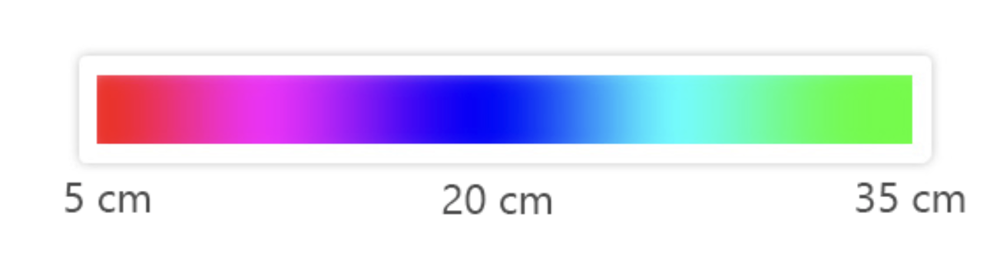
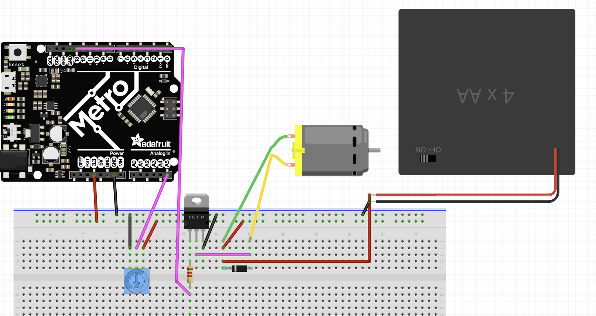

# Engineering 3 Documentation 

## Table of Contents
* [Table of Contents](#TableOfContents)
* [Hello_CircuitPython](#Hello_CircuitPython)
* [CircuitPython_Servo](#CircuitPython_Servo)
* [CircuitPython_LCD](#CircuitPython_LCD)
* [NextAssignmentGoesHere](#NextAssignment)
---

## Ultrasonic Sensor

### Description & Code
For this assignment, we had to use an HC-SRO4 (ultrasonic sensor) to measure the distance to an object an then print out that value to the serial monitor. Then, we coded the neopixel to change color based on the distance; it should turn red when the object is less than 5cm aways, and green when its above 35 cm. In between, the color should be based on the gradient below:

```python
Code goes here

```

### Evidence

### Wiring

### Reflection


## Motor_Control

### Description & Code
For this assignment, we had to wire up a DC motor with a 6V battery pack, transistor, and diode. Then, we had to write CircuitPython code to make the motor speed up and slow down relative to the potentiometer value. 

Here is the code to control the motor based on potentiometer value:

```python
import board
from analogio import AnalogIn
import pwmio

potentiometer = AnalogIn(board.A5) # Init potentiometer 
motor_speed_control = pwmio.PWMOut(board.D13) # Set up PWM signal

while True:
    pot_position = potentiometer.value # Read current potentiometer value
    print((pot_position))
    motor_speed_control.duty_cycle = pot_position # Adjust motors speed
```
Controlling the speed of our DC motor w/ PWM involves suppling a series of high and low pulses to the motor. The key parameter, 'duty_cycle,' defines how much of one period the signal is "high" vs low. Higher duty cycle means faster-running motor. 

### Evidence


And here is how you should give image credit to someone if you use their work:

Image credit goes to [Rick A](https://www.youtube.com/watch?v=dQw4w9WgXcQ&scrlybrkr=8931d0bc)


### Wiring

Made in Fritzing

### Reflection
The most challenging part of the assignment by far was wiring. I learned that it's better to do the wiring modularly, instead of trying to wire everything at once; for instance, the potentiometer can be treated as a separate unit both code and wiring-wise. 
What went wrong / was challenging, how'd you figure it out, and what did you learn from that experience?  Your ultimate goal for the reflection is to pass on the knowledge that will make this assignment better or easier for the next person.


## NextAssignment

### Description & Code

```python
Code goes here

```

### Evidence

### Wiring

### Reflection

