# Engineering 3 Documentation 

## Table of Contents
* [Servo Control](#Servo_Control)
* [Ultrasonic_Distance_Sensor](#Ultrasonic_Distance_Sensor)
* [Motor_Control](#Motor_Control)
* [Hanger_Bracket](#Hanger_Bracket)
* [Swing_Arm](#Swing_Arm)
* [NextAssignmentGoesHere](#NextAssignment)
---

## Servo_Control

### Description & Code
For this CircuitPython assignment, we had first to get a 180° micro servo to sweep back and forth between 0 and 180° slowly. Then, we had to use two buttons, one to sweep the servo in a clockwise direction and the other counterclockwise. The button operates by moving the servo for however long it is held, which makes the coding simpler as debouncing is not needed.

Here is my code:
```python
import time
import board
import pwmio
from adafruit_motor import servo
from digitalio import DigitalInOut, Direction, Pull


# Create a PWMOut object on Pin A2.
pwm = pwmio.PWMOut(board.A2, duty_cycle=2 ** 15, frequency=50)

# Create a servo object, my_servo.
servo1 = servo.Servo(pwm)

button = DigitalInOut(board.D2)
button.direction = Direction.INPUT
button.pull = Pull.DOWN

# Initialize Button2
button2 = DigitalInOut(board.D5) 
button2.direction = Direction.INPUT
button2.pull = Pull.DOWN

current_angle = 0  # Initialize the angle

while True:
    if button.value:  # Button1 is pressed, turn clockwise
        current_angle += 10 
        current_angle = max(0, min(180, current_angle)) # Range restrict because 180 servo
        servo1.angle = current_angle # Set servo to calculated angle
    time.sleep(0.01)  

    if button2.value:  # Button2 is pressed, turn counterclockwise
        current_angle -= 10
        current_angle = max(0, min(180, current_angle))
        servo1.angle = current_angle  
    time.sleep(0.01)  
```

### Evidence
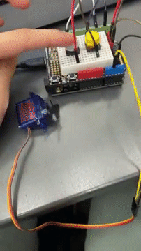

### Wiring
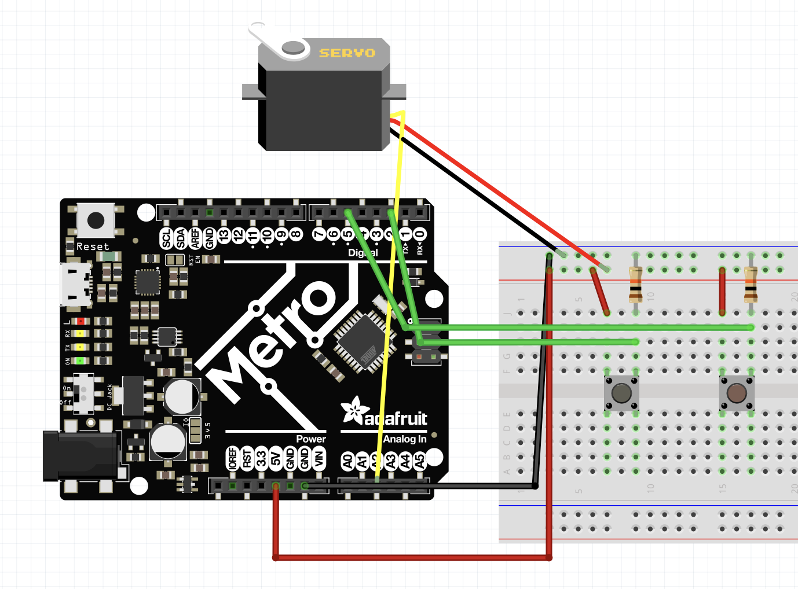

### Reflection
As the first assignment intersecting Arduino wiring and CircuitPython, the task was relatively simple. I initially misunderstood the "Spicy" section as optional and made my own button configuration. In this situation, only one button was needed, and as you held the button the servo would sweep back and forth, automatically switching directions when hitting 0 or 180 degrees. Upon the comment that two buttons were needed, I still misunderstood and instead tried an overly complicated system where debouncing was needed, and by pressing the button the servo would do a full sweep in one direction. Mr. H helped me and Josh to understand the requirements, and the resulting code is much more concise and effective. 
In my second configuration, I had much trouble with using the right conditionals. I didn't realize that if you initialize the button as a pull-up resistor as in the example I was referencing, then "button.value" will return true when pressed, which is counter-intuitive to me. I also didn't realize that if you wanted to switch to a pull-down resistor, a resistor is needed, and one end must go to GND to ensure the pin is pulled down to LOW when the button is not pressed. 

## Ultrasonic_Distance_Sensor

### Description & Code
For this assignment, we had to use an HC-SRO4 (ultrasonic sensor) to measure the distance to an object an then print out that value to the serial monitor. Then, we coded the neopixel to change color based on the distance; it should turn red when the object is less than 5cm aways, and green when its above 35 cm. In between, the color should be based on the gradient below:

Here is my code:
```python
import time
import board
import adafruit_hcsr04
import neopixel

sonar = adafruit_hcsr04.HCSR04(trigger_pin=board.D7, echo_pin=board.D6) # Init ultrasonic sensor

# Set up NeoPixel
NUMPIXELS = 1  
BRIGHTNESS = 0.2  
PIN = board.NEOPIXEL  
pixels = neopixel.NeoPixel(PIN, NUMPIXELS, brightness=BRIGHTNESS, auto_write=False)

# Mapping function to convert x from input range to corresponding value in output range
# x: value wanted to map | in_min & in_max: input range of x | out_min & out_max: output range
def map_value(x, in_min, in_max, out_min, out_max):
    return (x - in_min) * (out_max - out_min) / (in_max - in_min) + out_min

while True:
    try:
        cm = sonar.distance # receive ultrasonic distance
        print(cm)                 
        if(cm < 5): # Below 5, keep red
            pixels.fill((255, 0, 0))
        elif(cm < 20): # Blend between red and blue
            ratio = map_value(cm, 5, 20, 0, 1) #ratio of r:b
            r = int(255 * (1 - ratio))
            b = int(255 * ratio)
            pixels.fill((r, 0, b))
        elif(cm < 35): # Blend between blue and green 
            ratio = map_value(cm, 20, 35, 0, 1) #ratio of b:g
            b = int(255 * (1 - ratio))
            g = int(255 * ratio)
            pixels.fill((0, g, b))
        else: # Above 35, keep green
            pixels.fill((0, 255, 0))
        pixels.show()
    except RuntimeError:
        print("Retrying!")
    time.sleep(0.1)
```
Here's the logic of the mapping code:
1. ```(x-in_min)``` shifts the distance x so that the lower bound of the input distance range becomes 0
2. ```(out_max-out_min)/(in_max-in_min)``` calculates the scaling factor between the distance and color range; this is multiplied by the distance x to shift it into output scale
3. ```+ out_min``` shifts the value so that it starts at the lower bound of the output range

Here's the logic of the gradient code:
1. ```ratio = map_value(cm, 5, 20, 0, 1)``` calculates the mentioned scaling factor to proportionally map the distance to corresponding color
2. ```b = int(255 * ratio)``` calculates the blue value such that as the distance increases from 5 to 20, the blue intensity increases
3. ```r = int(255 * (1 - ratio))``` calculates the red value based on the opposite ratio so that as the distance increases, the red intensity increases

The gradient code works such that if cm = 5, 'ratio' will be 0 and there will be no blue, only red. If cm = 20, 'ratio' will be 1, meaning there will be no red, all blue. 

Inspiration: https://stackoverflow.com/questions/1969240/mapping-a-range-of-values-to-another

### Evidence
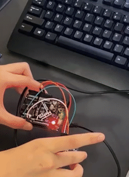

### Wiring
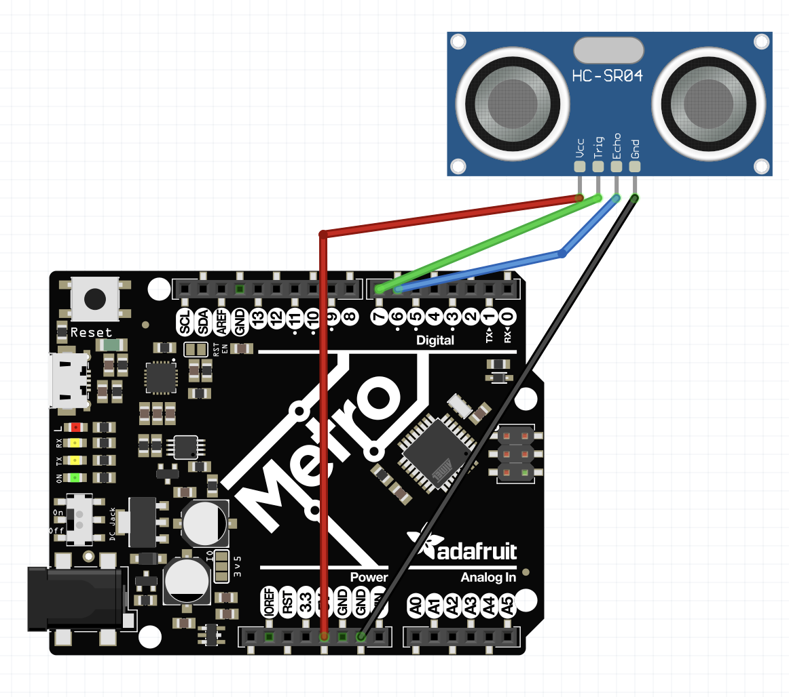

### Reflection
The wiring for the ulrasonic distance sensor was easy; only four wires directly to the metro board were needed. However, running successfull code proved much more challenging. I had a multitude of issues trying to receive data from the ultrasonic sensor. We then learned that we had to change all the libraries to be compatible with the ultrasonic sensor, changing the version from CircuitPython 8 to 7. The second part that was challenging with code was making a working NeoPixel gradient that corresponded with the distance. 
I consulted the Internet to see the best way to map values in CircuitPython. I did not find any useful built-in functions, but I did find the stackoverflow link below: 
https://stackoverflow.com/questions/1969240/mapping-a-range-of-values-to-another 
The map code function looked complicated, so I wrote some examples to help me illustrate the underlying concepts better. Essentially, we shift the input range to start at 0, multiply the new x value by the ratio of the ranges, and then shift x to start at the true output range. Gudrun also helped me understand the intuition behind the gradient, spliting it up as a red-blue gradient from 5-20 cm and a blue-green gradient from 20-35cm. 

## Motor_Control

### Description & Code
For this assignment, we had to wire up a DC motor with a 6V battery pack, transistor, and diode. Then, we had to write CircuitPython code to make the motor speed up and slow down relative to the potentiometer value. 

Here is the code to control the motor based on potentiometer value:

```python
import board
from analogio import AnalogIn
import pwmio

potentiometer = AnalogIn(board.A5) # Init potentiometer 
motor_speed_control = pwmio.PWMOut(board.D13) # Set up PWM signal

while True:
    pot_position = potentiometer.value # Read current potentiometer value
    print((pot_position))
    motor_speed_control.duty_cycle = pot_position # Adjust motors speed
```
Controlling the speed of our DC motor w/ PWM involves suppling a series of high and low pulses to the motor. The key parameter, 'duty_cycle,' defines how much of one period the signal is "high" vs low. Higher duty cycle means faster-running motor. 

### Evidence


### Wiring

Made in Fritzing

### Reflection
The most challenging part of the assignment by far was wiring. I learned that it's better to do the wiring modularly, instead of trying to wire everything at once; for instance, the potentiometer can be treated as a separate unit both code and wiring-wise. I did not realize the Mosfet Transistor's direction mattered - I was confused to why the motor was not running. Paul helped me debug my wiring, seeing that the Mosfet was flipped. This showed me that understanding what the parts of your system does is important, instead of blindly copying wiring diagrams from the internet. Additionally, I had many issues with controlling voltage. I had heard that the DC Motors could run with 9 Volts, and assumed that this fact held in this system. However, because we have a Mosfet transistor in the circuit, we should only use 6 Volts. The burning at the bottom of the Metro board signalled to me the severe voltage issue. In the future, I should try to thoroughly understand the mechanisms of new components so that I can properly debug and wire them up. I used Fritzing instead of TinkerCAD as Fritzing has all the parts needed.


## Hanger_Bracket

### Assignment Description

In our first Onshape assignment, we had to create a hanger bracket merely from drawings, with no supplemental instructions. We had 3 views available: the top, side, and isometric view. This was also practice for me on what view to choose to start your first sketch on; because of the side looks concave while the top drawing is rectangular, it made sense to start with the side view. 

### Evidence

<table>
  <tr>
    <td>
      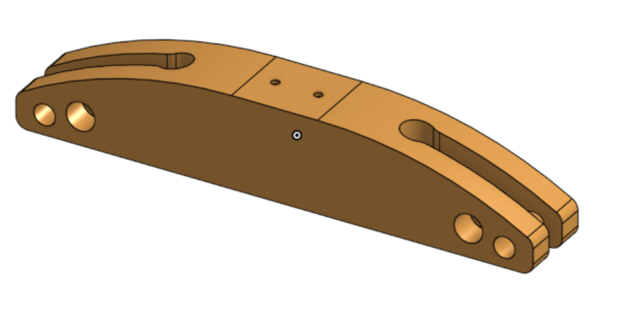
      <br>
      <i>Isometric View of Hanger Bracket</i>
    </td>
    <td>
      
      <br>
      <i>Side View</i>
    </td>
    <td>
      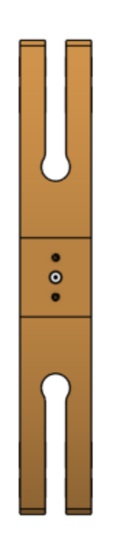
      <br>
      <i>Top View</i>
    </td>
  </tr>
</table>


### Part Link 

[Link to Onshape Document](https://cvilleschools.onshape.com/documents/672906f97ae1d055cf2d3e61/w/6dadd7e2d6761cce775b5b80/e/70dd84374060117a93b911c1?renderMode=0&uiState=652d53bff175cf7850ae8bbf)

### Reflection

We had previously done multiple practice Onshape assignments based purely on drawings in Engineering II, so I felt prepared for this assignment. However, there is always room for improvement to optimally create these parts, as the test requires not only accuracy but speed. Mr. Dierolf suggested that instead of creating the entire side profile, and manually mirroring every feature, we should create half of the part and then mirror the part. This saved both time and hassle. I also practiced good modeling habits by making use of constraints instead of extraneously dimensioning. From working with Mercedes, I realized that the best method to create the hole was not to draw the circle first, and then the rectangle, but draw a rectangle symmetric around the center line and create a circle centered on the right edge. Both of us were able to create an efficient hole! I also learned how to use HTML tables to create more aesthetic image placement, as seen above. 

## Swing_Arm

### Assignment Description
This is our second Onshape assignment, where we were given 2 pages of instructions and 4 drawings to create a Swing Arm part. Reminiscent of the true Onshape exam, we were told 3 values to change the dimensions of to test the mass of two configurations of the part. This ensures that the components are constrained correctly to one another; a fact that was not true in my case for the majority of the process, unfortunately. 

Here is my main sketch, which as I described in the reflection, should've been broken up into multiple to modularize. 
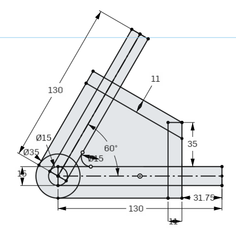
<br>
<i>Main Swing Arm Drawing Sketch</i>

### Evidence

<table>
  <tr>
    <td>
      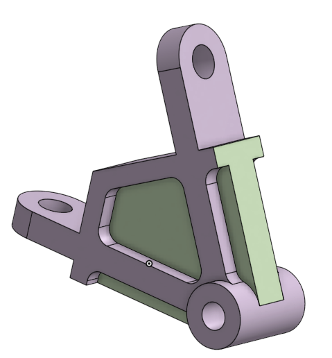
      <br>
      <i>Config 1 Isometric</i>
    </td>
    <td>
      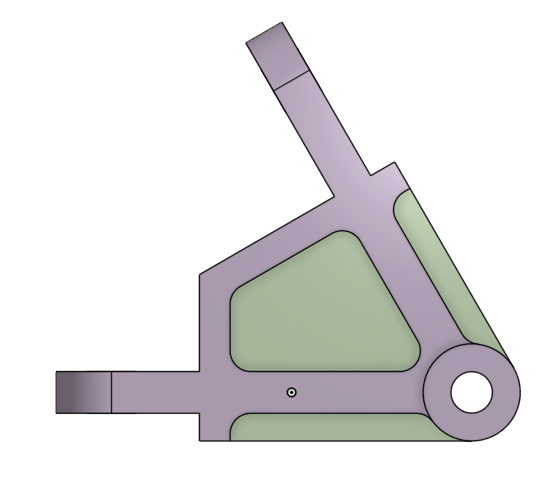
      <br>
      <i>Config 1 Side</i>
    </td>
    <td>
      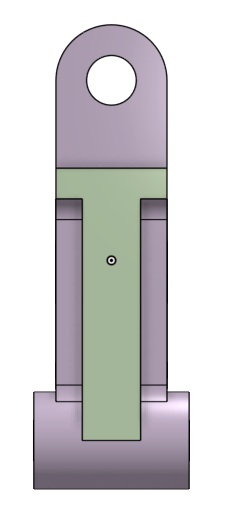
      <br>
      <i>Config 1 Bottom</i>
    </td>
    <td>
      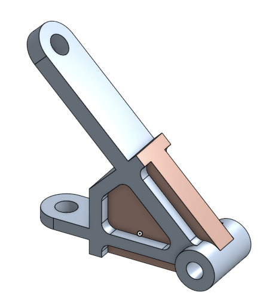
      <br>
      <i>Config 2 Isometric</i>
    </td>
  </tr>
</table>


### Part Link 

[Link to Onshape Document](https://cvilleschools.onshape.com/documents/672906f97ae1d055cf2d3e61/w/6dadd7e2d6761cce775b5b80/e/70dd84374060117a93b911c1?renderMode=0&uiState=652d53bff175cf7850ae8bbf)


### Reflection
I had many difficulties with obtaining the correct mass. For the longer configuration, I eventually decided to put both my and Gudrun's into the same assembley - while not the most honorable option, I was able to see my issue: one of the legs of my arm was constrained to the diameter of the circle, instead of to the dimension B. In the future, to debug in the case when the 1st configuration is correct but the 2nd is not, I recommend checking all the places where the variables affect first. I also had an issue when checking the 2nd configuration - as seen below, changing the B dimension would cause a divet to appear in the hinge. 

The divet highlights the importance of good design practices; instead of making components needlessly interconnected, it's better to make the parts in a modular process. If I had done the circle hole on a different sketch, then the constriants wouldn't have freaked out. 

## Onshape Certification Prep Part 1 - Single Part

### Assignment Description

This first prep assignment mimics the arguably easiest portion of the Onshape certification exam, which is the single part modeling. For the assignment, we had to create a V-block. The modeling was a good practice on using variables, as the real test will ask us to modify them to see if design intent was followed properly. 

### Evidence

<table>
  <tr>
    <td>
      
      <br>
      <i>Isometric View of Hanger Bracket</i>
    </td>
    <td>
      
      <br>
      <i>Side View</i>
    </td>
    <td>
      
      <br>
      <i>Top View</i>
    </td>
  </tr>
</table>


### Part Link 

[Link to Onshape Document](https://cvilleschools.onshape.com/documents/cd78b8fa1f4fae5e57aa9c82/w/e451815e3ceae4b1d9177709/e/d6cd4c60769dd8532e4bef87)

### Reflection

This assignment, while simple, was a good reminder that even though there are many different ways to build a part, there are methods that are much easier than others. For this assignment, I reaized I could expedite operations significantly if I built the part starting from the front view rather than the top; additionally, since the part is symmetric, I only needed to sketch the right part and I could mirror at the end for the complete structure. 
While not recommended for the actual Onshape exam, I think the best way to do the multiple iterations of these parts is through configurations. As we can't check our answers after each question and submit them at all one go, if one of our earlier iterations turns out to be incorrect, I can easily revert back to an old configuration. 

## Onshape Certification Prep Part 2 - Multi Part Studio

### Assignment Description

For further practice before our Onshape exam, we had to create a Cylinder Assembly using a multi-part studio. We were given 6 parts to model and 5 configurations to answer questions about. From Mr. Miller's hint, I know that this assignment is going to be highly similar to what we see on the exam, so I should practice this a couple times. 

### Evidence

<table>
  <tr>
    <td>
      
      <br>
      <i>Isometric View of Hanger Bracket</i>
    </td>
    <td>
      
      <br>
      <i>Side View</i>
    </td>
    <td>
      
      <br>
      <i>Top View</i>
    </td>
  </tr>
</table>


### Part Link 

[Link to Onshape Document](https://cvilleschools.onshape.com/documents/e5f7e6c15a3166969e564087/w/e5f7d6b88446670bd7923096/e/144b3be689b086a5e61060bc?renderMode=0&uiState=6604da5a7b7d3d0f008f6560)

### Reflection

This was my first rodeo with the Boolean tool - I realized how much easier it is to use the "subtract" operation than to try to employ the "Use" tool and extrude when creating a hole in the plunger top. Additionally, I found that instead of sketching circles and extruding, using the revolve tool, even for shapes that aren't seemingly cylinders at first glance, was much neater; I ended up using 3 revolves in the project!
I also realized grouping my sketches/operations into folders was a great way to keep organized, especially in complicated structures like this. 
Gudrun taught me a useful hack: In the assembley, instead of manually creating and mating 4 instances of the bolt, since each one is spaced 90 degrees apart, I can use the Circular pattern tool and created 4 instances.
&nbsp;

## Onshape Certification Prep Part 3 - Assemblies

### Assignment Description

This assignment is meant to imitate the 3rd portion of the modeling part of the Onshape exam, which tests our assembly skills. For this model, we had to assemble a functional locking plier, with a focus on having the correct rotation of the lower jaw. A;; 

### Evidence

<table>
  <tr>
    <td>
      
      <br>
      <i>Isometric View of Hanger Bracket</i>
    </td>
    <td>
      
      <br>
      <i>Side View</i>
    </td>
    <td>
      
      <br>
      <i>Top View</i>
    </td>
  </tr>
</table>


### Part Link 

[Link to Onshape Document](https://cvilleschools.onshape.com/documents/fddbbe19126bce08a2ac4a05/w/6244426ae9e97e5905a80ac0/e/346769cba18575cac10f62ab)

### Reflection

This was my first rodeo with the Boolean tool - I realized how much easier it is to use the "subtract" operation than to try to employ the "Use" tool and extrude when creating a hole in the plunger top. Additionally, I found that instead of sketching circles and extruding, using the revolve tool, even for shapes that aren't seemingly cylinders at first glance, was much neater; I ended up using 3 revolves in the project!
I also realized grouping my sketches/operations into folders was a great way to keep organized, especially in complicated structures like this. 
Gudrun taught me a useful hack: In the assembley, instead of manually creating and mating 4 instances of the bolt, since each one is spaced 90 degrees apart, I can use the Circular pattern tool and created 4 instances spaces.
&nbsp;

## Robot Gripper

### Assignment Description

For further practice before our Onshape exam, we had to create a Cylinder Assembly using a multi-part studio. We were given 6 parts to model and 5 configurations to answer questions about. From Mr. Miller's hint, I know that this assignment is going to be highly similar to what we see on the exam, so I should practice this a couple times. 

### Evidence

<table>
  <tr>
    <td>
      
      <br>
      <i>Isometric View of Hanger Bracket</i>
    </td>
    <td>
      
      <br>
      <i>Side View</i>
    </td>
    <td>
      
      <br>
      <i>Top View</i>
    </td>
  </tr>
</table>


### Part Link 

[Link to Onshape Document]()

### Reflection

This was my first rodeo with the Boolean tool - I realized how much easier it is to use the "subtract" operation than to try to employ the "Use" tool and extrude when creating a hole in the plunger top. Additionally, I found that instead of sketching circles and extruding, using the revolve tool, even for shapes that aren't seemingly cylinders at first glance, was much neater; I ended up using 3 revolves in the project!
I also realized grouping my sketches/operations into folders was a great way to keep organized, especially in complicated structures like this. 
Gudrun taught me a useful hack: In the assembley, instead of manually creating and mating 4 instances of the bolt, since each one is spaced 90 degrees apart, I can use the Circular pattern tool and created 4 instances spaces.

&nbsp;
## Photointerruptor

### Description & Code
Everytime the photointerruptor is triggered (optical switch activated by light blockage), I had to increment a counter and print the number to an LCD screen. I then simulated "lag" by incrementing the counter only after 4 seconds of being interrupted. 

```python
Code goes here

```

### Evidence


### Wiring

### Reflection
Both the wiring and code were intuitive for our first CircuitPython assignment of the quarter. However, I ran into an issue where the LCD would show no output. I initially thought that it had to do with the contrast settings, but adjustment did nothing. I figured out that the system did not recognize the I2C address. To overcome this, I used code from here - https://learn.adafruit.com/scanning-i2c-addresses/circuitpython - to scan for I2C addresses to find where the LCD was at, which was 0x27. This scanning code will definitely help me find the correct I2C address in future assignments. 

## Rotary Encoder & LCD

### Description & Code

For this assignment, I had to use a rotary encoder to control a menu-based traffic light, whichs menu is displayed on a LCD screen and light status is represented with the on-board NeoPixel LED. The encoder position corresponds to the cycle index of the menu items: stop, caution, and go. The LED turned red, yellow, or green depending on this menu status. 

```python
Code goes here

```

### Evidence


### Wiring

### Reflection
I remember doing this assignment last year - nevertheless, this proved to be the most difficult CircuitPython assignment so far. I ran into the same I2C issue as previous, but I was able to use the address finder to overcome that hurdle. The main obstacle was getting the menu index to iterate and output correctly. When I first printed the messages to the screen and I tried to move to the "go" option, "goution" would print out. I realized that I wasn't clearing the 2nd row when I switched states. For a workaround, I printed out the option along with 8 spaces to effectively clear the previous output. 

## Stepper Motors & Limit Switches

### Description & Code
Using a stepper motor, I had to trigger a limit switch. If the stepper motor was initially rotating clockwise, once the attached arm hit the limit switch, the stepper motor had to rotate counterclockwise. This behavior should be repeated indefinitely. 

```python
Code goes here

```

### Evidence
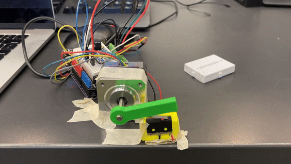

### Wiring
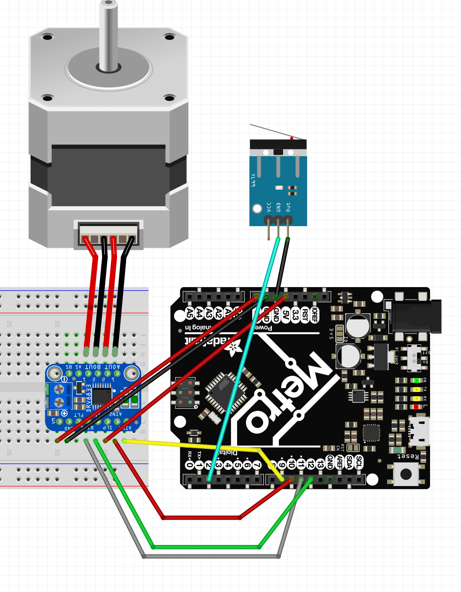
Made in Fritzing

### Reflection
I struggled with regulating the voltage properly. Perhaps because the Mac I use is weaker than the Windows Desktop, whenever I try to upload code to the Metro that is wired to something pulling high voltage, the Metro does not appear as an option to connect to. I did not realize my computer was the issue, so I tried to wire a battery pack to the Metro to provide power for the Stepper Motor. I had plugged the 9V wire to VIN and the black wire into GND. Luckily, I had not put in any batteries, as Gudrun informed me that what I had done would smoke the H-bridge.
From this assignment, I learned the trick to plug-in high voltage projects into my computer and one way not to smoke H-bridge. 

## IR Sensors

### Description & Code

Using an IR sensor, I had to change the color of the on-board NeoPixel LED. Depending on whether the IR sensor sent a HIGH (an object is near) or LOW (nothing nearby) signal, the NeoPixel LED should turn red or green, respectively. 

```python
Code goes here

```

### Evidence


### Wiring
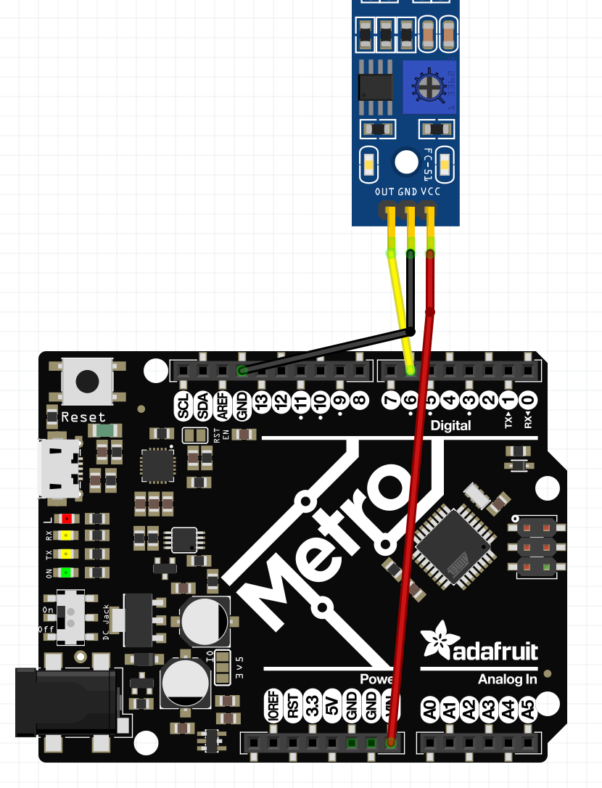
Made in Fritzing

### Reflection
Compared to the earlier assignments, coordinating the IR sensor value with the neopixel output was relatively simple. However, I ran into an annoying issue with uploading code, where I would get an error that any CircuitPython function was not found. After spending awhile tinkering with extensions, I found a work-around: I directly opened the CircuitPython directory and edited the code.py file. While I haven't figured out how to properly fix this issue, I was able to complete the assignment effectively. I found that instead of using inverse logic, I could instead classify the ir_sensor as a pull down resistor, which makes the code logic cleaner. 


## NextAssignment

### Description & Code

```python
Code goes here

```

### Evidence

### Wiring

### Reflection

