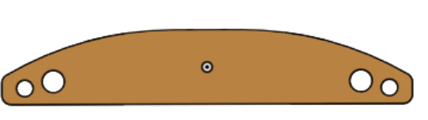

# Engineering 3 Documentation 

## Table of Contents
* [Table of Contents](#TableOfContents)
* [Ultrasonic_Distance_Sensor](#Ultrasonic_Distance_Sensor)
* [Motor_Control](#Motor_Control)
* [Hanger_Bracket](#Hanger_Bracket)
* [NextAssignmentGoesHere](#NextAssignment)
---

## Ultrasonic_Distance_Sensor

### Description & Code
For this assignment, we had to use an HC-SRO4 (ultrasonic sensor) to measure the distance to an object an then print out that value to the serial monitor. Then, we coded the neopixel to change color based on the distance; it should turn red when the object is less than 5cm aways, and green when its above 35 cm. In between, the color should be based on the gradient below:

Here is my code:
```python
import time
import board
import adafruit_hcsr04
import neopixel

sonar = adafruit_hcsr04.HCSR04(trigger_pin=board.D7, echo_pin=board.D6) # Init ultrasonic sensor

# Set up NeoPixel
NUMPIXELS = 1  
BRIGHTNESS = 0.2  
PIN = board.NEOPIXEL  
pixels = neopixel.NeoPixel(PIN, NUMPIXELS, brightness=BRIGHTNESS, auto_write=False)

# Mapping function to convert x from input range to corresponding value in output range
# x: value wanted to map | in_min & in_max: input range of x | out_min & out_max: output range
def map_value(x, in_min, in_max, out_min, out_max):
    return (x - in_min) * (out_max - out_min) / (in_max - in_min) + out_min

while True:
    try:
        cm = sonar.distance # receive ultrasonic distance
        print(cm)                 
        if(cm < 5): # Below 5, keep red
            pixels.fill((255, 0, 0))
        elif(cm < 20): # Blend between red and blue
            ratio = map_value(cm, 5, 20, 0, 1) #ratio of r:b
            r = int(255 * (1 - ratio))
            b = int(255 * ratio)
            pixels.fill((r, 0, b))
        elif(cm < 35): # Blend between blue and green 
            ratio = map_value(cm, 20, 35, 0, 1) #ratio of b:g
            b = int(255 * (1 - ratio))
            g = int(255 * ratio)
            pixels.fill((0, g, b))
        else: # Above 35, keep green
            pixels.fill((0, 255, 0))
        pixels.show()
    except RuntimeError:
        print("Retrying!")
    time.sleep(0.1)
```
Here's the logic of the mapping code:
1. ```(x-in_min)``` shifts the distance x so that the lower bound of the input distance range becomes 0
2. ```(out_max-out_min)/(in_max-in_min)``` calculates the scaling factor between the distance and color range; this is multiplied by the distance x to shift it into output scale
3. ```+ out_min``` shifts the value so that it starts at the lower bound of the output range

Here's the logic of the gradient code:
1. ```ratio = map_value(cm, 5, 20, 0, 1)``` calculates the mentioned scaling factor to proportionally map the distance to corresponding color
2. ```b = int(255 * ratio)``` calculates the blue value such that as the distance increases from 5 to 20, the blue intensity increases
3. ```r = int(255 * (1 - ratio))``` calculates the red value based on the opposite ratio so that as the distance increases, the red intensity increases

The gradient code works such that if cm = 5, 'ratio' will be 0 and there will be no blue, only red. If cm = 20, 'ratio' will be 1, meaning there will be no red, all blue. 

Inspiration: https://stackoverflow.com/questions/1969240/mapping-a-range-of-values-to-another

### Evidence


### Wiring

### Reflection
The wiring for the ulrasonic distance sensor was easy; only four wires directly to the metro board were needed. However, running successfull code proved much more challenging. I had a multitude of issues trying to receive data from the ultrasonic sensor. We then learned that we had to change all the libraries to be compatible with the ultrasonic sensor, changing the version from CircuitPython 8 to 7. The second part that was challenging with code was making a working NeoPixel gradient that corresponded with the distance. 
I consulted the Internet to see the best way to map values in CircuitPython. I did not find any useful built-in functions, but I did find the stackoverflow link below: 
https://stackoverflow.com/questions/1969240/mapping-a-range-of-values-to-another 
The map code function looked complicated, so I wrote some examples to help me illustrate the underlying concepts better. Essentially, we shift the input range to start at 0, multiply the new x value by the ratio of the ranges, and then shift x to start at the true output range. Gudrun also helped me understand the intuition behind the gradient, spliting it up as a red-blue gradient from 5-20 cm and a blue-green gradient from 20-35cm. 

## Motor_Control

### Description & Code
For this assignment, we had to wire up a DC motor with a 6V battery pack, transistor, and diode. Then, we had to write CircuitPython code to make the motor speed up and slow down relative to the potentiometer value. 

Here is the code to control the motor based on potentiometer value:

```python
import board
from analogio import AnalogIn
import pwmio

potentiometer = AnalogIn(board.A5) # Init potentiometer 
motor_speed_control = pwmio.PWMOut(board.D13) # Set up PWM signal

while True:
    pot_position = potentiometer.value # Read current potentiometer value
    print((pot_position))
    motor_speed_control.duty_cycle = pot_position # Adjust motors speed
```
Controlling the speed of our DC motor w/ PWM involves suppling a series of high and low pulses to the motor. The key parameter, 'duty_cycle,' defines how much of one period the signal is "high" vs low. Higher duty cycle means faster-running motor. 

### Evidence


### Wiring

Made in Fritzing

### Reflection
The most challenging part of the assignment by far was wiring. I learned that it's better to do the wiring modularly, instead of trying to wire everything at once; for instance, the potentiometer can be treated as a separate unit both code and wiring-wise. I did not realize the Mosfet Transistor's direction mattered - I was confused to why the motor was not running. Paul helped me debug my wiring, seeing that the Mosfet was flipped. This showed me that understanding what the parts of your system does is important, instead of blindly copying wiring diagrams from the internet. Additionally, I had many issues with controlling voltage. I had heard that the DC Motors could run with 9 Volts, and assumed that this fact held in this system. However, because we have a Mosfet transistor in the circuit, we should only use 6 Volts. The burning at the bottom of the Metro board signalled to me the severe voltage issue. In the future, I should try to thoroughly understand the mechanisms of new components so that I can properly debug and wire them up. I used Fritzing instead of TinkerCAD as Fritzing has all the parts needed.


## Hanger_Bracket

### Assignment Description

In our first Onshape assignment, we had to create a hanger bracket merely from drawings, with no supplemental instructions. We had 3 views available: the top, side, and isometric view. This was also practice for me on what view to choose to start your first sketch on; because of the side looks concave while the top drawing is rectangular, it made sense to start with the side view. 

### Evidence

<table>
  <tr>
    <td>
      
      <br>
      <i>Isometric View of Hanger Bracket</i>
    </td>
    <td>
      
      <br>
      <i>Side View</i>
    </td>
    <td>
      
      <br>
      <i>Top View</i>
    </td>
  </tr>
</table>


### Part Link 

[Link to Onshape Document](https://cvilleschools.onshape.com/documents/b67a1cbdc4ed63f9002ebb08/w/293d5130df730dbda2e77585/e/f1a428b62fae888cdf29c451?renderMode=0&uiState=65256c8dc3bf36111c9e574c)

### Reflection

We had previously done multiple practice Onshape assignments based purely on drawings in Engineering II, so I felt prepared for this assignment. However, there is always room for improvement to optimally create these parts, as the test requires not only accuracy but speed. Mr. Dierolf suggested that instead of creating the entire side profile, and manually mirroring every feature, we should create half of the part and then mirror the part. This saved both time and hassle. I also practiced good modeling habits by making use of constraints instead of extraneously dimensioning. From working with Mercedes, I realized that the best method to create the hole was not to draw the circle first, and then the rectangle, but draw a rectangle symmetric around the center line and create a circle centered on the right edge. Both of us were able to create an efficient hole! I also learned how to use HTML tables to create more aesthetic image placement, as seen above. 

&nbsp;


## NextAssignment

### Description & Code

```python
Code goes here

```

### Evidence

### Wiring

### Reflection

